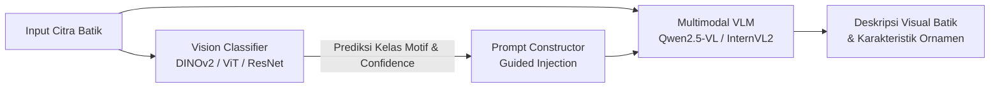

# 🎨 Batik Multimodal Image Captioning & Classification with Vision-Language Models (VLMs)

[](https://www.python.org/)
[](https://pytorch.org/)
[](https://huggingface.co/)
[](https://github.com/huggingface/peft)
[](https://fastapi.tiangolo.com/)
[]()

Research thesis project focused on **Fine-Grained Indonesian Batik Motif Classification** and **Multimodal Visual Captioning** using State-of-the-Art Vision-Language Models (VLMs) and Vision Transformers with Parameter-Efficient Fine-Tuning (LoRA).

Developed on GPU Server infrastructure at **Faculty of Computer Science (FILKOM), Universitas Brawijaya**.

---

## 📌 Daftar Isi
- [Ringkasan Proyek](#-ringkasan-proyek)
- [Arsitektur & Alur Sistem](#-arsitektur--alur-sistem)
- [Daftar Motif Batik (24 Kelas)](#-daftar-motif-batik-24-kelas)
- [Model yang Digunakan](#-model-yang-digunakan)
- [Struktur Repositori](#-struktur-repositori)
- [Instalasi & Persiapan Lingkungan](#-instalasi--persiapan-lingkungan)
- [Bobot Model (Pre-trained & LoRA Adapters)](#-bobot-model-pre-trained--lora-adapters)
- [Panduan Penggunaan](#-panduan-penggunaan)
  - [1. Training Model](#1-training-model)
  - [2. Inferensi Pipeline](#2-inferensi-pipeline)
  - [3. Evaluasi Metrik](#3-evaluasi-metrik)
  - [4. Deployment Demo Web (FastAPI)](#4-deployment-demo-web-fastapi)
- [Metrik Evaluasi](#-metrik-evaluasi)
- [Kontributor & Sitasi](#-kontributor--sitasi)

---

## 📖 Ringkasan Proyek

Batik Indonesia memiliki kompleksitas visual tinggi, ornamen ragam hias (*isen-isen*), serta nilai filosofi mendalam. Proyek ini memadukan **Vision Classifier** dan **Multimodal Vision-Language Model (VLM)** ke dalam satu arsitektur *cascaded pipeline* terpadu:

1. **Tahap 1 (Klasifikasi Visual):** Vision model (DINOv2 / ViT / ResNet) mendeteksi dan mengidentifikasi kelas motif batik dari citra masukan.
2. **Tahap 2 (Guided Prompt Injection & Captioning):** Kelas motif yang teridentifikasi diinjeksikan secara terstruktur ke dalam prompt VLM (Qwen2.5-VL / InternVL2 / Flan-T5 / OPT) untuk menghasilkan deskripsi visual yang kaya, presisi, objektif, dan minim halusinasi.

---

## 🏗️ Arsitektur & Alur Sistem



---

## 🏷️ Daftar Motif Batik (24 Kelas)

Dataset mencakup 24 kelas motif batik nusantara:
1. Lamongan
2. Malang
3. Trenggalek
4. Tulungagung
5. Betawi
6. Bokor Kencono
7. Buketan
8. Dayak
9. Jlamprang
10. Kawung
11. Liong
12. Mega Mendung
13. Parang
14. Sekarjagad
15. Sidoluhur
16. Sidomukti
17. Sidomulyo
18. Singa Barong
19. Srikaton
20. Tribusono
21. Tujuh Rupa
22. Truntum
23. Wahyu Tumurun
24. Wirasat

---

## 🤖 Model yang Digunakan

### 1. Vision Classifiers (Tahap 1)
* **DINOv2 (Meta AI)**: Backbone *Self-Supervised Vision Transformer* dengan LoRA adapter.
* **ViT (Vision Transformer)**: Baseline transformer visual (`best_vit.pth`).
* **ResNet**: Baseline CNN konvensional (`best_resnet_clean.pth`).

### 2. Vision-Language Models / LLM (Tahap 2)
* **Qwen2.5-VL (7B)**: Model multimodal *state-of-the-art* dengan LoRA fine-tuning (bahasa Indonesia & Inggris).
* **InternVL2 (8B)**: Model multimodal multimodal resolusi dinamis dengan LoRA adapter.
* **Flan-T5 (XL)**: Encoder-Decoder LLM untuk image-to-text generation.
* **OPT (2.7B)**: Decoder-only autoregressive LLM.

---

## 📂 Struktur Repositori

```
├── src/                          # Source code utama
│   ├── classifier/               # Skrip training DINOv2, ResNet, ViT & inferensi
│   ├── qwen/                     # Training & inferensi Qwen2.5-VL (Inject, No-Inject, Zero-shot)
│   ├── internval/                # Training & pipeline InternVL2
│   ├── flan_t5/                  # Training & inferensi Flan-T5 XL
│   ├── opt/                      # Training & inferensi OPT 2.7B
│   └── common/                   # Pipeline terintegrasi & utilitas evaluasi
│
├── etc/                          # Modul tambahan & deployment
│   ├── deploy/                   # Backend FastAPI (main.py) & Frontend Web (index.html)
│   ├── experiment/               # Eksperimen pembuatan caption & prompt ablation
│   ├── batch/                    # Hasil inferensi batch & prediksi per model
│   ├── hasil/                    # Komputasi metrik & hasil eksperimen
│   └── leakage/                  # Eksperimen analisis integritas split data & ablasi
│
├── notebooks/                    # Jupyter Notebooks untuk analisis data & visualisasi
│   ├── visualisasi.ipynb         # Grafik perbandingan kurva loss & metrik
│   ├── uji.ipynb                 # Pengujian model & kualitatif
│   └── caption.ipynb             # Eksperimen generate caption
│
├── evaluation_results/           # Rekap metrik hasil evaluasi (BLEU, METEOR, ROUGE, SPICE, CLIP)
├── requirements.txt              # Daftar dependency lingkungan Python
└── README.md                     # Dokumentasi proyek
```

---

## ⚙️ Instalasi & Persiapan Lingkungan

### 1. Clone Repositori
```bash
git clone https://github.com/DzakaAufa/Batik-Image-Captioning-Thesis-.git
cd Batik-Image-Captioning-Thesis-
```

### 2. Setup Virtual Environment
Disarankan menggunakan Python 3.10+ dan PyTorch yang kompatibel dengan CUDA:
```bash
python3 -m venv venv
source venv/bin/activate
```

### 3. Install Dependencies
```bash
pip install --upgrade pip
pip install -r requirements.txt
```

---

## 📦 Bobot Model (Pre-trained & LoRA Adapters)

Karena ukuran checkpoint model (`.safetensors`, `.pth`) melebihi batas 100 MB di GitHub, seluruh bobot model di-host secara terpisah di **[Hugging Face Model Hub](https://huggingface.co/dzakaaufa/batik-captioning-models)**.

### Cara Memuat Model dari Hugging Face:
```python
from peft import PeftModel
from transformers import AutoModelForVision2Seq, AutoProcessor

# Load base model & LoRA adapter dari Hugging Face
model_id = "Qwen/Qwen2.5-VL-7B-Instruct"
adapter_repo = "dzakaaufa/batik-captioning-models"

base_model = AutoModelForVision2Seq.from_pretrained(model_id, torch_dtype="auto", device_map="auto")
model = PeftModel.from_pretrained(base_model, adapter_repo, subfolder="models/qwen2.5-vl-7b-eng_inject2")
```

---

## 🚀 Panduan Penggunaan

### 1. Training Model

* **Training Classifier DINOv2 (LoRA):**
  ```bash
  python src/classifier/train_dino.py
  ```
* **Training Qwen2.5-VL Captioning (Guided Injection):**
  ```bash
  python src/qwen/train_eng.py
  ```

### 2. Inferensi Pipeline Terpadu
Menjalankan inferensi gabungan (klasifikasi motif + pembuatan caption deskriptif):
```bash
python src/common/pipeline.py
```

### 3. Evaluasi Metrik
Menghitung skor evaluasi linguistik dan multimodal terhadap data uji:
```bash
python evaluation_results/metric/metric.py
```

### 4. Deployment Demo Web (FastAPI)
Menjalankan server backend lokal untuk antarmuka interaktif:
```bash
python etc/deploy/main.py
```
Buka peramban di `http://localhost:8000` untuk mengakses antarmuka demo.

---

## 📊 Metrik Evaluasi

Sistem dievaluasi menggunakan metrik standar Natural Language Generation (NLG) dan Vision-Language:

| Kategori | Metrik | Deskripsi |
| :--- | :--- | :--- |
| **Lexical Match** | BLEU-1, BLEU-4 | Presisi n-gram kata terhadap referensi |
| **Recall / F1** | ROUGE-L | Kecocokan subsequences terpanjang |
| **Semantic & Alignment** | METEOR, SPICE | Kecocokan semantik & scene-graph propositional |
| **Embedding Similarity** | BERTScore | Kedekatan semantik berbasis contextual embedding |
| **Image-Text Relevance**| CLIPScore | Keselarasan visual antara citra input dan caption yang dihasilkan |

---

## 👥 Kontributor & Sitasi

* **Penulis / Peneliti:** Dzaka Aufa
* **Institusi:** Program Studi Teknik Informatika, Fakultas Ilmu Komputer (FILKOM), Universitas Brawijaya.

---
*Dikembangkan untuk kemajuan pelestarian dan dokumentasi digital Warisan Budaya Takbenda Batik Indonesia melalui Kecerdasan Buatan.*
